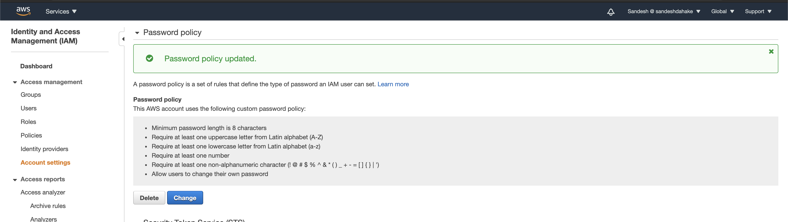
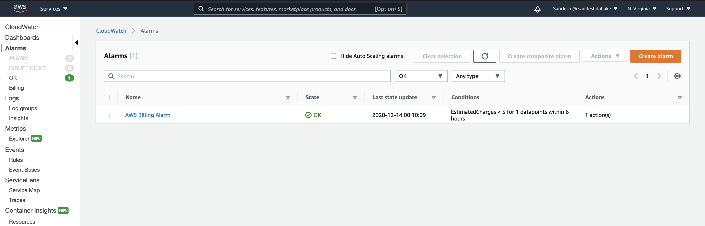
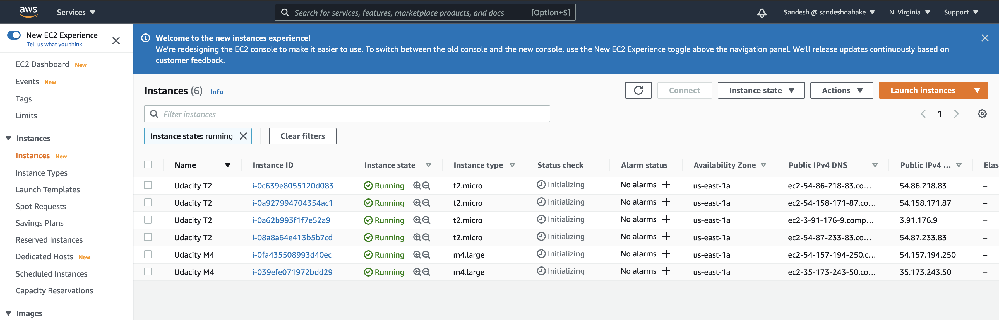
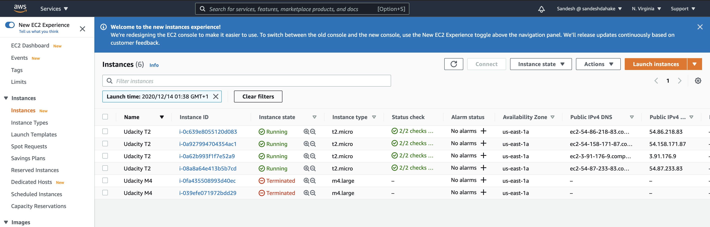
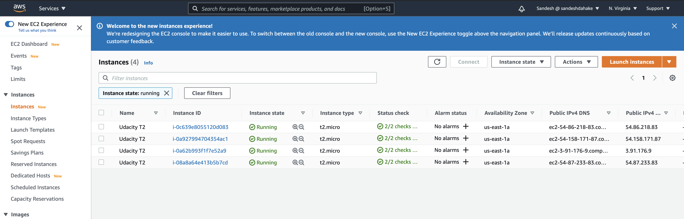
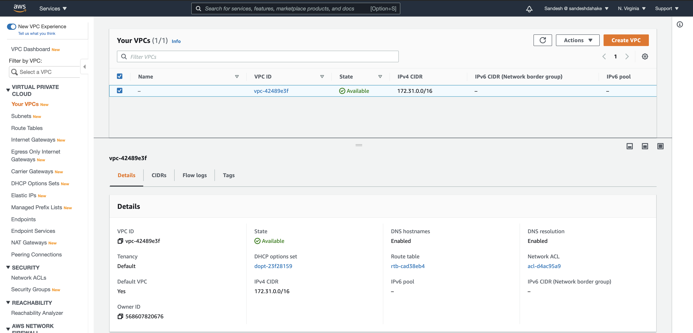
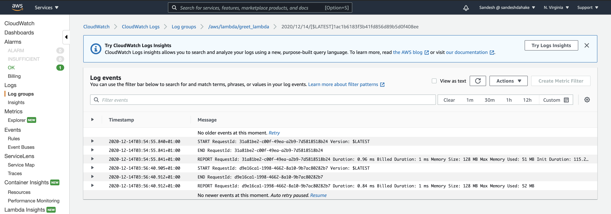
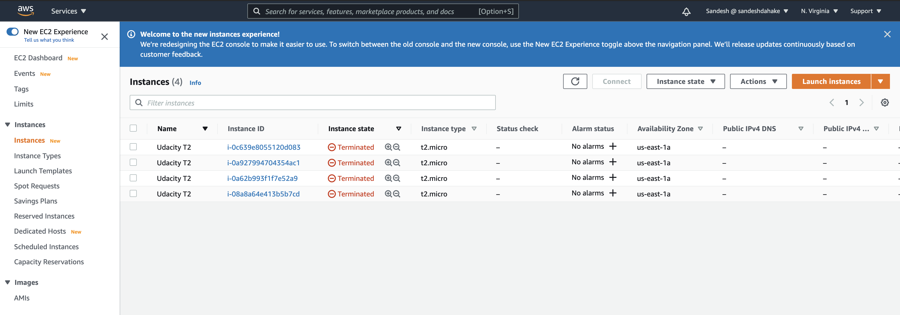

# Cloud Developer ND Course 2: Design for Performance and Scalability

In this project, you will plan, design, provision, and monitor infrastructure in AWS using industry-standard and open source tools. You will practice the skills you have learned throughout the course to optimize infrastructure for cost and performance. You will also use Terraform to provision and configure AWS services in a global configuration.

## Project  Instructions

### Task 1: Create AWS Architecture Schematics

You have been asked to plan and provision a cost-effective AWS infrastructure for a new social media application development project for 50,000 single-region users. The project requires the following AWS infrastructure and services. Please include your name and label all elements of the infrastructure on the diagram.

Infrastructure in the following regions: us-east-1
Users and Client machines
One VPC
Two Availability Zones
Four Subnets (2 Public, 2 Private)
A NAT Gateway
A CloudFront distribution with an S3 bucket
Web servers in the Public Subnets sized according to your usage estimates
Application Servers in the Private Subnets sized according to your usage estimates
DB Servers in the Private Subnets
Web Servers Load Balanced and Autoscaled
Application Servers Load Balanced and Autoscaled
A Master DB in AZ1 with a read replica in AZ2

Answer

[Infrastructure diagram 1](./Udacity_Diagram_1.pdf)

You have been asked to plan a SERVERLESS architecture schematic for a new application development project. The project requires the following AWS infrastructure and services.

A user and client machine
AWS Route 53
A CloudFront Distribution
AWS Cognito
AWS Lambda
API Gateway
DynamoDB
S3 Storage

Answer

[Infrastructure diagram 2](./Udacity_Diagram_2.pdf)

### Task 2: Calculate Infrastructure Costs

Use the AWS Pricing Calculator to estimate how much it will cost to run the services in your Part 1 diagram for one month.

Target a monthly estimate between $8,000-$10,000.
Be mindful of AWS regions when you are estimating costs.
Export the estimate as a CSV file named Initial_Cost_Estimate.csv.

Answer

[Initial Cost Estimate](./Initial_Cost_Estimate.csv)

Your budget has been reduced from $8,000-$10,000 to a maximum of $6,500. What services will you modify to meet this new budget? Export the updated costs in a CSV file named Reduced_Cost_Estimate.csv and write up a brief narrative of the changes you made in the CSV file below the cost estimate.

Answer

[Reduced Cost Estimate](./Reduced_Cost_Estimate.csv)

[Reduced Cost Estimate Rationale](./Reduced_Cost_Estimate_rationale.pdf)

Your budget has been increased to $20,000. What resources will you add and why?
Think about where to add redundancy and how to improve performance. Re-configure your estimate to a monthly invoice of $18K-20K. Export the updated costs to a CSV file named Increased_Cost Estimate.csv and write up a brief narrative of the changes you made in the CSV file below the cost estimate.

Answer

[Increased_Cost Estimate](./Increased_Cost_Estimate.csv)

[Increased_Cost Estimate Rationale](./Increased_Cost_Estimate_rationale.pdf)

### Task 3: Configure Permissions

In order to complete this task, please ensure your IAM users have been granted access to the billing dashboard (Activating Access to the Billing and Cost Management Console).

Update the AWS password policy.

Minimum password length = 8
Require at least one uppercase letter
Require at least one lowercase letter
Require at least one number
Require at least one non-alphanumeric character.

Answer

[CloudTrail Log](./screenshots/UdacityCloudTrailLog.csv)

### Task 4: Set up Cost Monitoring

1. Configure CloudWatch billing alarm

2. Set up a Billing alarm with a $5 threshold

3. Set up notification so that you get an email alert when the alarm is triggered.

Answer

### Task 5 : Use Terraform to Provision AWS Infrastructure

#### Exercise 1

1. Download the [starter code](https://github.com/udacity/cand-c2-project).
2. In the main.tf file write the code to provision
   * AWS as the cloud provider
   * Use an existing VPC ID
   * Use an existing public subnet
   * 4 AWS t2.micro EC2 instances named Udacity T2
   * 2 m4.large EC2 instances named Udacity M4
3. Run Terraform.
4. Take a screenshot of the 6 EC2 instances in the AWS console and save it as `Terraform_1_1`.
5. Use Terraform to  delete the 2 m4.large instances
6. Take an updated screenshot of the AWS console showing only the 4 t2.micro instances and save it as `Terraform_1_2`

Answer

#### Exercise 2

1. In the  Exercise_2 folder, write the code to deploy an AWS Lambda Function using Terraform. Your code should include:

   * A lambda.py file
   * A main.tf file with AWS as the provider, and IAM role for Lambda, a VPC, and a public subnet
   * An outputs.tf file
   * A variables.tf file with an AWS region

2. Take a screenshot of the EC2 instances page
3. Take a screenshot of the VPC page

Answer

### Task 6: Destroy the Infrastructure using Terraform

Answer

